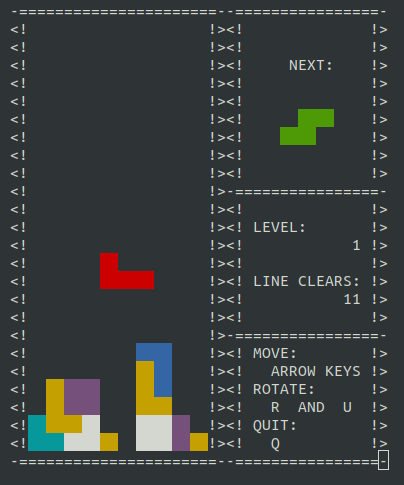

# tetris
An implementation of the basic tetris game principle, rendered with ncurses in a terminal.

The heart of this project is contained in the folder `tetris`. The goal of this
implementation is to be as memory-efficient as possible. No inheritance is used.
C++'s principle of zero overhead guarantees that the object-oriented style doesn't
cost additional resources while maintaining optimal readability of code.

The memory efficience is established by defining each tetris shape exactly once in
memory, and the I and O shapes share the same memory representation. Rotations are
achieved by modifying the coordinate access to the shape. (The access is based on the
fact  that rotating a matrix 90° corresponds to transposing it and then inverting the
order of columns.)

Attention: The coordinates are used like matrix indices, for example 

    (i/j) = (h/w)

    (0/0) (0/1) (0/2)

    (1/0) (1/1) (1/2)

    (2/0) (2/1) (2/2)

In the main program a fully working tetris implementation using the above library is
shown. Rendering is done with the library ncurses

